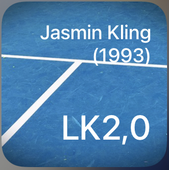

# :tennis: mybigpoint-lk-widget
 
 This widget shows your current mybigpoint LK.
 
## Widget Design and Functionality

The widget shows your name and the year you were born in at the top. At the bottom your current mybigpoint LK is displayed.</br>
The data is received from the following web page: [WTB-Tennis] (https://www.wtb-tennis.de/spielbetrieb/vereine.html). Therefore you must be a member of a club listed there. This is also the page where you can find your club's ID, which is a required configuration parameter. In addition, you need to know your own ID-Number. See [Setup] (https://github.com/jkling2/mybigpoint-lk#setup) for further information on how to specify these configuration parameter.

## Requirements
* Apple Device with iOS 14.
* Scriptable latest (https://scriptable.app/).

## Setup
1. Copy the source code for ```mybigpoint-lk.js``` ("raw").
2. Open Scriptable.
3. Select "+" and insert the copy of the script.
4. Choose the title of the script (e.g. MyBigPoint-LK).
5. Save with "Done".
6. Go back to the iOS Homescreen and get into the "wiggle mode".
7. Press the "+" symbol and look for "Scriptable".
8. Choose widget size (small) and "Add widget".
9. Go into the settings of the widget to edit it.
   * Choose script of step #4.
   * Provide your ID-Number and the ID of your club, separated by comma (e.g. ```29300539,20206``` for Jasmin Kling (29300539) at TC BW Vaihingen-Rohr (20206)).

**Enjoy the widget!**
